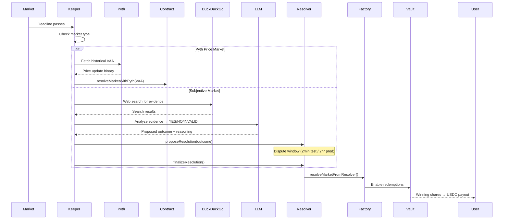

# Verity


> A social sports prediction app and on-chain arena where players compete in PvP matchmaking duels backed by USDC prediction markets.

## Problem Statement

Sports prediction platforms are often isolated from competitive social engagement, and traditional prediction markets can feel overly complex and dry.

- Social networks lack built-in accountability or stakes for sports predictions.
- Traditional prediction markets lack direct player-vs-player (PvP) competitive layers and user community building.
- It's hard to match predictions directly against other sports fans with opposing views in a fun, social environment.

## Solution

Verity fuses sports prediction duels with underlying prediction markets on the Arc Testnet, creating a social, competitive arena where fans face off directly in PvP prediction matchups.

1. **Social PvP Arena (Primary)**
   - Create tickets containing multiple predictions for a sports matchup event.
   - Algorithms match you against other users in your rank tier based on prediction divergence.
   - Interact with the community, follow other sports predictors, and discuss matchups via nested comment threads on matchups/posts.
2. **On-Chain AMM Trading (Underlying Engine)**
   - Tickets are translated into positions in underlying USDC-backed Fixed Product Market Maker (FPMM) pools.
   - Prices dynamically adjust based on pool liquidity and user trades.
3. **Autonomous & Optimistic Resolution**
   - Pyth price feeds automatically settle price-based prediction markets.
   - An AI agent powered by configurable LLMs (Claude, Gemini, OpenAI, DeepSeek) and DuckDuckGo web search handles subjective resolution proposals, managed by an optimistic resolution dispute window.

## How It Works

### 1. Market Lifecycle

A prediction market on Verity follows a progressive lifecycle:

```plaintext
Event Created → Qualified (Escrow Funding) → Tradable (20 USDC reached, AMM live)
→ Closed (Predictions Locked) → Resolving → Resolved (Winning payouts)
```

### 2. Trading Mechanics

Users buy outcome tokens (YES or NO shares) through a Fixed Product Market Maker. Prices shift based on demand — the more people buy YES, the higher the YES price.

```javascript
// Buy YES tokens on a market
const trade = {
  marketId: '...',
  side: 'YES',
  amountUsdc: 10,
  tradingFeeBps: 200, // 2% fee
}
```

### 3. Resolution Flow



### 4. Nanopayments & Fee Distribution (Circle Batching)

Verity utilizes an off-chain/on-chain hybrid micro-payout engine (Nanopayments) powered by **Circle's X402 Batching Gateway Client (`@circle-fin/x402-batching`)** to distribute accumulated fees without incurring prohibitive on-chain transaction costs.

- **Trading Fees**: Every buy/sell transaction incurs a `2.0%` fee (200 BPS).
  - **60%** goes to the pool's Liquidity Providers (LPs).
  - **40%** goes to the Creator Royalties / Treasury.
- **LP Fee Payouts**: LP fees are calculated off-chain and accumulated in the `LpFeeLedger` model in MongoDB. When a user's accrued fees cross the auto-push threshold (configured via `LP_FEE_AUTOPUSH_THRESHOLD_USDC`), or when they manually trigger a claim, a Circle WaaS transaction is submitted via the `NanopaymentsService` to pay out the USDC.
- **Creator Royalties**: Creator royalties are similarly tracked and batched from trade fees, then sent directly to the creator's wallet address via the Circle Gateway Client.

## Architecture

```plaintext
Verity/
├── contracts/           # Foundry Smart Contracts (Solidity)
│   └── src/
│       ├── ConditionalTokenVault.sol   # USDC escrow + outcome token minting
│       ├── VerityMarketFactory.sol     # Market registry + pool deployment
│       ├── VerityFPMM.sol              # Fixed Product Market Maker (AMM)
│       └── VerityOptimisticResolver.sol # Dispute-window resolution system
├── backend/             # NestJS 11 API Server
│   └── src/
│       ├── modules/
│       │   ├── agent/           # AI resolution agent (Claude/Gemini/OpenAI/DeepSeek)
│       │   ├── auth/            # Passwordless Email OTP via Resend + JWT guard
│       │   ├── blockchain/      # Viem on-chain reads/writes + AA decoder
│       │   ├── liquidity/       # LP pool state, positions, chain sync
│       │   ├── markets/         # Market CRUD, voting, trading, keeper loop
│       │   ├── pvp/             # PvP Arena duels, matchmaking, tickets, boosts
│       │   ├── coupons/         # Promotional duel boost coupons
│       │   ├── missions/        # Onboarding achievements
│       │   ├── categories/      # Category tag filters
│       │   ├── circle-wallet/   # Circle WaaS provisioning & Nanopayments payouts
│       │   ├── notifications/   # Activity feed notifications
│       │   ├── posts/           #社交 posts coordinators
│       │   ├── socket/          # WebSocket real-time updates
│       │   └── users/           # Wallet profiles + signal tracking
│       └── common/              # Guards, filters, interceptors
└── frontend/            # Next.js (App Router) + React 19
    └── src/
        ├── app/                 # Pages: feed, markets, profile, portfolio, notifications
        ├── components/          # PvP Arena tabs, ticket builders, layout
        ├── hooks/               # Market liquidity, USDC transfers, socket
        ├── lib/                 # Arc chain config, contract ABIs, type definitions
        └── store/               # Zustand stores + TanStack Query API layer
```

## Core Components

### Smart Contracts (Foundry / Solidity 0.8.24)

Four contracts deployed on Arc Testnet handle the full market lifecycle: a **ConditionalTokenVault** for USDC escrow and outcome token minting, a **VerityMarketFactory** for market registration and automatic pool deployment, a **VerityFPMM** for AMM trading, and a **VerityOptimisticResolver** for dispute-window based resolution.

### Backend API (NestJS 11)

A modular REST API with Swagger documentation, passwordless Email OTP authentication with local database verification, Circle smart account wallet provisioning, WebSocket broadcasting for real-time feed updates, an automated keeper service that resolves expired markets every 30 seconds using AI agents or Pyth price oracles, and a gas-efficient Circle Nanopayments payout engine for micro-fees/royalties.

### Frontend (Next.js + React 19)

A premium social prediction interface with automatic smart wallet provisioning (Circle WaaS Account Abstraction), USDC-backed market trading, PvP matchmaking duels with interactive ticket builders, and a responsive styling layout.

## Getting Started

### 1. Prerequisites

- **Node.js 18+** & **pnpm**
- **MongoDB** (local or remote)
- **Foundry** (for contract development)

### 2. Setup Environment

Clone and install dependencies:

```bash
git clone https://github.com/JWattjr/Verity.git
cd Verity
pnpm install
```

Configure the services:

```bash
# Backend configuration
cd backend && cp .env.example .env

# Frontend configuration
cd ../frontend && cp .env.example .env
```

### 3. Build & Deploy Contracts

If you wish to deploy your own instance of the contracts:

```bash
cd contracts
forge build
forge script script/Deploy.s.sol:Deploy \
  --rpc-url https://rpc.testnet.arc.network \
  --private-key <YOUR_PRIVATE_KEY> \
  --broadcast
```

### 4. Boot the Ecosystem

Run the frontend and backend concurrently:

```bash
# Terminal 1
pnpm dev:backend

# Terminal 2
pnpm dev:frontend
```

## How to Test the Product

1. **Log In**: Visit `http://localhost:3000` and sign in with your email using passwordless OTP via Resend.
2. **Onboard**: Upon authentication, a Circle SCA wallet is automatically provisioned for you. Fund your wallet with testnet USDC.
3. **Submit PvP Prediction Ticket**: Browse active events, pick outcomes across at least 3 propositions, apply any available boosts/coupons, and submit your ticket to the PvP matchmaking queue.
4. **Opponent Matchmaking**: The system matches you against other queued users in your rank tier based on prediction divergence. If no player is found by the event lock time, you are matched with a bot.
5. **Trade Outcomes**: You can buy/sell outcomes in underlying child markets of active events. Watch prices move dynamically as pools are funded.
6. **Watch Resolution**: Once the event's lock time/deadline passes, the keeper automatically resolves the event (using Pyth historical feeds or LLM agent proposals). Duels are scored, XP is awarded to winners, and winning tickets can be redeemed for USDC.

---

<p align="center">Built for the Arc Testnet</p>
